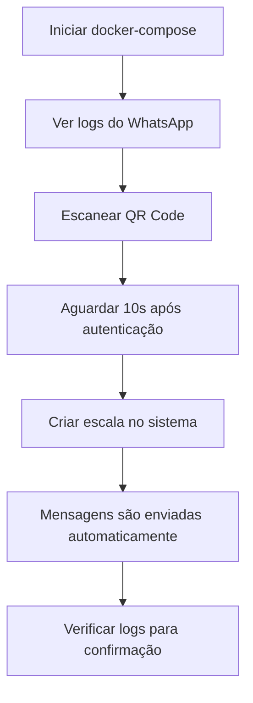

# 📱 Guia de Configuração do WhatsApp

## Arquitetura

O sistema WhatsApp agora funciona como um **microserviço separado**:

```
┌─────────────────┐         ┌──────────────────┐
│                 │  HTTP   │                  │
│  Backend API    │────────▶│  WhatsApp Service│
│  (porta 5000)   │         │  (porta 3000)    │
└─────────────────┘         └──────────────────┘
                                     │
                                     ▼
                            ┌──────────────────┐
                            │  WhatsApp Web.js │
                            │   + Chromium     │
                            └──────────────────┘
```

## Passo a Passo para Configuração

### 1. **Configurar Variáveis de Ambiente**

Certifique-se de que seu arquivo `backend/.env` contém:

```env
WHATSAPP_ENABLED=true
WHATSAPP_SERVICE_URL=http://whatsapp:3000
MASTER_ADMIN_EMAIL=seu_email@gmail.com
```

### 2. **Iniciar os Containers**

```bash
# Parar containers antigos (se existirem)
docker-compose down

# Remover volumes antigos do WhatsApp (se tiver problemas)
docker volume rm dunamys_whatsapp_session dunamys_whatsapp_temp

# Iniciar todos os serviços
docker-compose up -d

# Verificar se os containers estão rodando
docker ps
```

### 3. **Verificar Logs do WhatsApp**

```bash
# Ver logs em tempo real
docker logs dunamys-whatsapp -f
```

Você deve ver algo como:

```
🔄 Inicializando WhatsApp Service...
🚀 WhatsApp Microservice rodando na porta 3000
📱 QR Code recebido - Escaneie para conectar
[QR CODE AQUI]
```

### 4. **Conectar o WhatsApp**

#### Opção A: Via Logs (Recomendado)

O QR Code aparece nos logs do container. Use o comando acima e escaneie com seu WhatsApp.

#### Opção B: Via Frontend

1. Faça login como admin master
2. Vá em **Admin → WhatsApp**
3. Clique em **"Conectar WhatsApp"**
4. Escaneie o QR Code que aparece

### 5. **Verificar Conexão**

Após escanear o QR Code, você deve ver nos logs:

```
🔐 WhatsApp Web autenticado com sucesso
🎉 WhatsApp Web conectado e pronto para uso
📱 Aguardando 10 segundos para garantir que o chat store carregue...
✅ WhatsApp totalmente pronto para enviar mensagens!
```

### 6. **Testar Envio de Mensagens**

```bash
# Testar via curl (substitua o número)
curl -X POST http://localhost:3000/send \
  -H "Content-Type: application/json" \
  -d '{
    "phone": "11999999999",
    "message": "Teste de mensagem do sistema!"
  }'
```

Ou via interface do admin:
1. Crie uma escala de teste
2. Adicione um membro com telefone válido
3. Verifique os logs para ver se a mensagem foi enviada

## Problemas Comuns e Soluções

### ❌ Problema: "WhatsApp não está conectado"

**Causa:** O microserviço não está pronto ou não foi autenticado.

**Solução:**
```bash
# Verificar status do container
docker ps | grep whatsapp

# Verificar logs
docker logs dunamys-whatsapp -f

# Se necessário, reconectar
curl -X POST http://localhost:3000/reconnect
```

### ❌ Problema: "Número não está registrado no WhatsApp"

**Causa:** O número não existe no WhatsApp ou está mal formatado.

**Solução:**
- Certifique-se de que o número está no formato: `11999999999` (DDD + número)
- Verifique se o número realmente tem WhatsApp

### ❌ Problema: QR Code não aparece

**Causa:** Sessão antiga pode estar corrompida.

**Solução:**
```bash
# Parar o container
docker stop dunamys-whatsapp

# Remover volume de sessão
docker volume rm dunamys_whatsapp_session

# Reiniciar
docker-compose up -d whatsapp

# Ver logs para novo QR Code
docker logs dunamys-whatsapp -f
```

### ❌ Problema: Mensagens não são enviadas

**Causa:** WhatsApp pode não estar totalmente pronto após autenticação.

**Solução:**
- Aguarde 10-15 segundos após ver "WhatsApp conectado"
- Verifique os logs detalhados:

```bash
docker logs dunamys-whatsapp -f
```

Você verá logs detalhados de cada tentativa de envio:

```
🔵 ============ NOVA REQUISIÇÃO DE ENVIO ============
📋 Dados recebidos: { phone: '11999999999', messageLength: 150 }
✅ WhatsApp está pronto!
🚀 Iniciando envio para: 11999999999
📱 Número formatado: 5511999999999@c.us
🔍 Verificando se número está registrado no WhatsApp...
✅ Número 11999999999 ESTÁ registrado no WhatsApp
📤 Enviando mensagem...
✅✅✅ Mensagem ENVIADA COM SUCESSO para 11999999999
```

## Verificação de Saúde do Sistema

### Verificar Backend

```bash
curl http://localhost:5000/api/health
```

Deve retornar:
```json
{
  "status": "OK",
  "services": {
    "database": "connected",
    "redis": "connected",
    "whatsapp": "connected"  ← deve estar "connected"
  }
}
```

### Verificar Microserviço WhatsApp

```bash
curl http://localhost:3000/health
```

Deve retornar:
```json
{
  "status": "OK",
  "whatsapp": "connected",  ← deve estar "connected"
  "timestamp": "2025-10-03T..."
}
```

### Verificar Status WhatsApp

```bash
curl http://localhost:3000/status
```

Deve retornar:
```json
{
  "connected": true,  ← deve ser true
  "hasQR": false,
  "timestamp": "2025-10-03T..."
}
```

## Arquitetura de Volumes

```yaml
volumes:
  whatsapp_session:  # Armazena a sessão autenticada
  whatsapp_temp:     # Arquivos temporários do Chromium
```

**IMPORTANTE:** Não delete o volume `whatsapp_session` depois de autenticado, ou você terá que escanear o QR Code novamente!

## Logs Detalhados

O sistema agora tem logs extremamente detalhados. Para cada envio de mensagem, você verá:

1. **Recebimento da requisição** com dados do telefone
2. **Verificação de prontidão** do WhatsApp
3. **Formatação do número** para padrão internacional
4. **Verificação de registro** no WhatsApp
5. **Tentativa de envio** da mensagem
6. **Confirmação de sucesso** ou erro detalhado

## Fluxo Completo de Uso



## Dicas de Debug

1. **Sempre verifique os logs primeiro:**
   ```bash
   docker logs dunamys-whatsapp -f
   ```

2. **Verifique se o container está rodando:**
   ```bash
   docker ps | grep whatsapp
   ```

3. **Teste a comunicação entre backend e microserviço:**
   ```bash
   # Do backend, teste se consegue acessar o microserviço
   docker exec dunamys-backend curl http://whatsapp:3000/health
   ```

4. **Se algo der errado, reinicie do zero:**
   ```bash
   docker-compose down
   docker volume rm dunamys_whatsapp_session dunamys_whatsapp_temp
   docker-compose up -d
   ```

## Próximos Passos

Após configurar o WhatsApp:

1. ✅ Crie escalas de teste
2. ✅ Adicione membros com números válidos
3. ✅ Verifique se as notificações são enviadas
4. ✅ Monitore os logs para identificar problemas

## Suporte

Se continuar com problemas:

1. Copie os logs completos: `docker logs dunamys-whatsapp > whatsapp-logs.txt`
2. Verifique as mensagens de erro nos logs
3. Teste o envio manual via curl
4. Verifique se o número está correto (DDD + número, sem +55)
